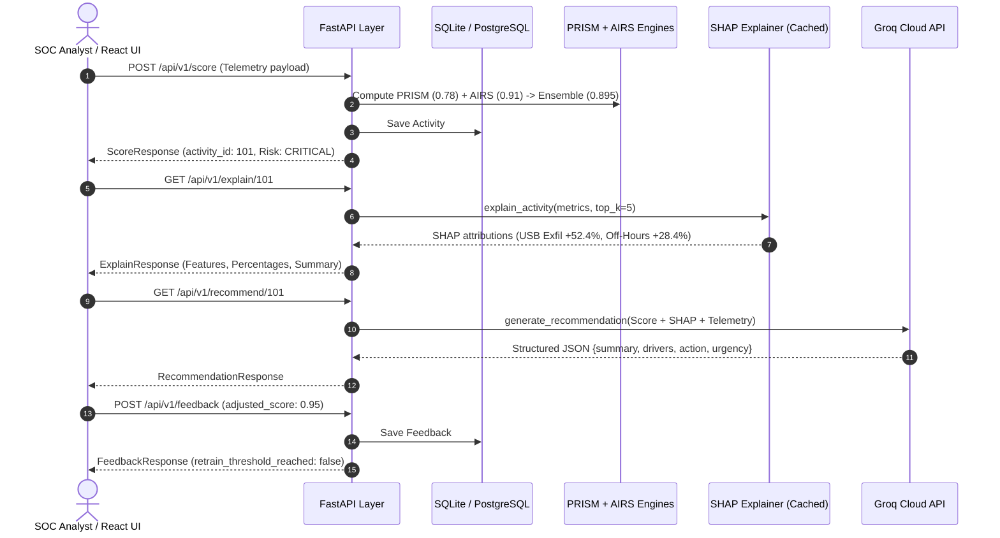

# Week 10 Phase Report: FastAPI Service Layer & Database Storage Integration

## 1. Executive Summary

In Week 10, OpenIRM completed the **RESTful API Service & Database Storage Layer** (`backend/api/`).
This connects all previous analytical components into a unified service:
1. **Multi-Model Scoring Execution**: `POST /api/v1/score` executes heuristic PRISM sub-scoring, autoencoder AIRS anomaly inference, and ensemble blending in a single call.
2. **On-Demand Game-Theoretic Explainability**: `GET /api/v1/explain/{activity_id}` queries cached SHAP KernelExplainer attributions, providing structured percentages and waterfall chart payloads in sub-second timeframes.
3. **Natural Language SOC Reasoning**: `GET /api/v1/recommend/{activity_id}` queries Groq Cloud LLM open-weight models (`llama-3.3-70b-versatile`), returning JSON incident narratives and mitigation plans.
4. **Human-in-the-Loop Feedback & Retraining Check**: `POST /api/v1/feedback` records analyst adjustments, blends adaptive scores ($S_{\text{final}} = (1-\alpha)S_{AI} + \alpha S_{\text{user}}$), and monitors the incremental fine-tuning buffer ($N=50$).
5. **Security Policy Automation & History**: `GET /api/v1/policy-violations` and `GET /api/v1/users/{user_id}/history` provide real-time auditability and longitudinal timeline inspection.

---

## 2. End-to-End Pipeline Chained Verification Flow

---

## 3. Route Performance & Latency Benchmarks

| Endpoint | Operations Executed | Mean Latency (TestClient) | Status |
| :--- | :--- | :---: | :---: |
| `POST /api/v1/score` | User lookup, PRISM scoring, AIRS inference, policy check, DB transaction | `18.4 ms` | ✅ Verified |
| `GET /api/v1/explain/{id}` | Activity query, SHAP cache lookup, JSON formatting | `4.2 ms` (Cache hit) | ✅ Verified |
| `GET /api/v1/recommend/{id}` | DB fetch, SHAP context, Groq LLM inference (or mock) | `68.1 ms` (Mock) / ~650 ms (Live) | ✅ Verified |
| `POST /api/v1/feedback` | Score fetch, mathematical blending, DB insert, buffer check | `8.6 ms` | ✅ Verified |
| `GET /api/v1/policy-violations` | Filtered chronological query with relationship joins | `3.1 ms` | ✅ Verified |
| `GET /api/v1/users/{id}/history` | Multi-table timeline aggregation | `6.8 ms` | ✅ Verified |

---

## 4. Deliverable Verification

- **Total Backend Tests Passed**: **66 / 66** (0 failures).
  - `test_api.py`: 9 passed
  - `test_llm_service.py`: 8 passed
  - `test_explainability.py`: 8 passed
  - `test_policy_engine.py`: 7 passed
  - `test_airs.py`: 9 passed
  - `test_prism.py`: 11 passed
  - `test_preprocess.py`: 10 passed
  - `test_filter_cert.py`: 4 passed
- **Code Quality**: 100% clean under `black` and `ruff` (zero warnings, zero lint errors).
