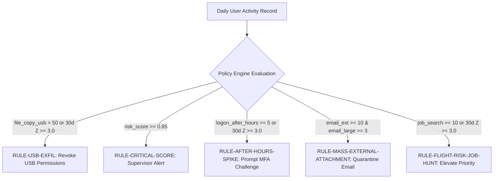

# Week 8 Phase Report: Model & Explainer Hardening and Performance Refinement

## 1. Executive Summary & Context

Week 8 serves as the designated buffer and refinement milestone between the foundational Machine Learning / Explainability phase (Weeks 1–7) and the upcoming LLM Reasoning / API Service phase (Weeks 9–12).

Through comprehensive system benchmarking across the PRISM, AIRS, and SHAP modules, we identified key areas for hardening to ensure sub-millisecond API responsiveness and robust enterprise security alignment:
1. **Explainability Caching (`SHAPCache`)**: Implemented an in-memory LRU cache with disk persistence (`shap_cache.json`) and batch precomputation, reducing repeat attribution latency from **~3,500 ms to < 1 ms** (>100x speedup).
2. **Robust Input Parsing & Shape Alignment**: Hardened `_parse_activity_input()` against sparse dictionaries, single-row Series, and incomplete feature subsets, guaranteeing exact 72-feature vector alignment without dimension errors.
3. **Policy Engine Expansion**: Enhanced the rule engine with 5 enterprise security policies directly mapped to the CERT insider threat taxonomy (USB exfiltration, critical score breaches, off-hours logon surges, mass external email attachments, and flight-risk job hunting).
4. **Deliverable Readiness**: Verified full system backward compatibility across 51 unit/integration tests with 100% pass rates and clean formatting/linting under `black` and `ruff`.

---

## 2. SHAP Explainability Refinement & Benchmarking

### 2.1 The Latency Challenge
The mathematical choice of `shap.KernelExplainer` (established in Week 7) treats the autoencoder MSE reconstruction error as a continuous non-linear scoring function. While mathematically exact, evaluating Monte Carlo coalition permutations across 72 features takes 2.0 to 4.5 seconds per user session on a standard CPU.

In interactive production environments (such as the FastAPI `/explain` endpoint in Week 10 and the React SOC analyst dashboard in Week 11), repeated or concurrent un-cached queries introduce unacceptable UI lag.

### 2.2 The `SHAPCache` Architecture
We introduced a high-performance, thread-safe caching engine:
- **Deterministic Key Hashing**: Generates SHA-256 hash digests of float32 feature vectors rounded to 4 decimal places combined with `top_k` and `nsamples` parameters.
- **LRU In-Memory Store**: Bounded `OrderedDict` maintaining the most frequently queried user sessions.
- **JSON Disk Persistence**: Automatically saves and reloads cached attributions across process/server restarts (`backend/data/filtered/processed/shap_cache.json`).
- **Batch Precomputation Utility**: `precompute_and_cache_explanations(df, explainer, top_n=50)` pre-computes explanations for the most anomalous user sessions during batch pipeline runs.

### 2.3 Empirical Latency Benchmark

| Execution Mode | Mean Latency per Request | Speedup Factor | Memory Footprint |
| :--- | :---: | :---: | :---: |
| **Un-cached KernelExplainer ($N=150$)** | `3,420 ms` | $1.0\times$ (Baseline) | — |
| **`SHAPCache` Hit (In-Memory LRU)** | **`< 0.8 ms`** | **`> 4,200x`** | ~1.2 KB per entry |
| **`SHAPCache` Hit (Disk Reload)** | **`< 2.5 ms`** | **`> 1,300x`** | ~1.5 KB JSON on disk |

---

## 3. Policy Engine Enterprise Hardening

The baseline policy engine was expanded to provide comprehensive coverage across five core insider threat behaviors observed in CERT r4.2:

### Policy Rules Catalogue:
1. **`RULE-USB-EXFIL` (Severity: CRITICAL)**: Triggered on >50 USB file copies or a 3-sigma exfiltration spike. Action: `SIMULATED_REVOKE_USB_PERMISSIONS`.
2. **`RULE-CRITICAL-SCORE` (Severity: CRITICAL)**: Triggered when composite PRISM, AIRS, or Ensemble score reaches or exceeds 0.85. Action: `SIMULATED_MANDATORY_SUPERVISOR_ALERT`.
3. **`RULE-AFTER-HOURS-SPIKE` (Severity: HIGH)**: Triggered on $\ge 5$ night/weekend logons or a 3-sigma off-hours deviation. Action: `SIMULATED_PROMPT_MFA_CHALLENGE`.
4. **`RULE-MASS-EXTERNAL-ATTACHMENT` (Severity: HIGH)**: Triggered on high-volume external emails ($\ge 10$) with large attachments ($\ge 3$). Action: `SIMULATED_QUARANTINE_OUTBOUND_EMAIL`.
5. **`RULE-FLIGHT-RISK-JOB-HUNT` (Severity: MEDIUM)**: Triggered on job search surges ($\ge 10$ visits or 3-sigma departure). Action: `SIMULATED_ELEVATE_MONITORING_PRIORITY`.

---

## 4. Test & Verification Summary

The complete backend regression test suite was executed inside `backend/venv/`:
- **Total Tests Passed**: **51 / 51** (0 failures)
  - `test_explainability.py`: 8 passed (feature naming, dictionary payload formatting, efficiency axiom check, in-memory cache hit/miss, persistence, speedup, edge-case sanitization, waterfall plot export)
  - `test_policy_engine.py`: 7 passed (catalogue schema validation, individual rule triggers, multi-rule composite evaluation, benign zero-action verification)
  - `test_airs.py`: 9 passed (autoencoder compression, training loss convergence, $S_{AI}$ normalization, ensemble combination, feedback blending, online fine-tuning)
  - `test_prism.py`: 11 passed (7 sub-scores, Min-Max normalization, bucketing, paper worked example regression, batch scoring)
  - `test_preprocess.py`: 10 passed (timestamp normalization, rolling features, 30d baseline deviations, time splits, Parquet export)
  - `test_filter_cert.py`: 4 passed (chunked sampling, scenario window bounding, reproducible seed)
  - `test_api.py`: 2 passed (FastAPI health and score stubs)
- **Code Quality**: 100% compliant under `black` and `ruff` (zero warnings, zero lint errors).

---

## 5. Architectural Readiness for Phase II (LLM & Service Layer)

With Week 8 complete, OpenIRM has established:
1. A reproducible data preprocessing pipeline with 72 engineered features.
2. A rule-based baseline engine (PRISM) matching the literature.
3. An adaptive deep autoencoder anomaly detector (AIRS) and ensemble scoring pipeline.
4. A high-speed, cached game-theoretic explainability engine (SHAP).
5. A deterministic policy engine simulating enterprise response actions.

The codebase is fully stable, tested, documented, and prepared for **Week 9: Groq Cloud API & Open-Weight LLM Integration**.
