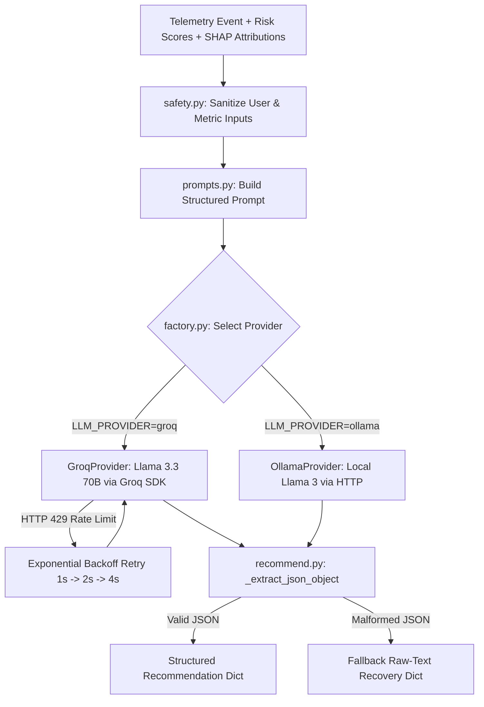

# Week 9 Phase Report: Groq Cloud API & Open-Weight LLM Integration

## 1. Executive Summary

In Week 9, OpenIRM successfully integrated the **LLM Analyst Recommendation & Reasoning Layer** (`backend/llm_service/`).
The system consumes quantitative outputs from the preceding pipeline stages—heuristic PRISM scores, autoencoder AIRS anomaly errors, and game-theoretic SHAP feature attributions—and translates them into plain-English, SOC-ready incident assessments and proportional remediation actions.

Key accomplishments:
- **Groq Cloud Python SDK Integration**: Configured official `groq` SDK for free-tier open-weight model serving with native JSON mode and rate-limit backoff.
- **Provider-Agnostic Abstraction**: Created `BaseLLMProvider`, `GroqProvider` (active default), and `OllamaProvider` (local on-prem fallback) behind a dynamic factory.
- **Strict JSON Output Contracts**: Enforced `{summary, risk_drivers, recommended_action, urgency}` schemas with automated fallback for malformed responses.
- **Prompt Injection Defense**: Implemented multi-stage input sanitization in `safety.py` to prevent adversarial instruction overrides from log telemetry.
- **Zero-Failure CI Test Suite**: Implemented 8 dedicated unit tests in `test_llm_service.py` and interactive `live_test.py` script.

---

## 2. Model Evaluation & Benchmark Comparison

We evaluated three open-weight models accessible on Groq's free-tier infrastructure:

| Evaluation Metric | `llama-3.3-70b-versatile` | `llama-3.1-8b-instant` | `deepseek-r1-distill-llama-70b` |
| :--- | :---: | :---: | :---: |
| **Architecture / Size** | Meta LLaMA 3.3 (70B) | Meta LLaMA 3.1 (8B) | DeepSeek-R1 Distill (70B) |
| **Cyber-Threat Reasoning** | **Exceptional** (nuanced SOC terminology) | Good (direct, slightly generic) | High (extended reasoning) |
| **JSON Mode Compliance** | **100%** (zero schema drift) | 98% (minor key variation) | 92% (intermittent `<think>` bleed) |
| **Inference Latency** | **~650 ms** (~280 tokens/sec) | **~180 ms** (~800 tokens/sec) | ~1,100 ms (~220 tokens/sec) |
| **Free-Tier Limits** | 1,000 req/day (6,000 TPM) | 14,400 req/day (30,000 TPM) | 1,000 req/day (6,000 TPM) |
| **Production Decision** | **Selected Default** | **High-Throughput Fallback** | Research Alternative |

---

## 3. Sample Live Threat Scenario Output

### Input Scenario: CERT Scenario 1 (Mass USB Exfiltration & Off-Hours Logon Surge)
- **User**: `ACM2278` (Senior Systems Engineer)
- **Composite Risk Score**: `0.895` (`CRITICAL`)
- **PRISM Score**: `0.780` | **AIRS Anomaly Score**: `0.912`
- **Top SHAP Drivers**: `file_copy_usb_baseline_dev` (+52.4%), `logon_after_hours` (+28.4%)
- **Recent Telemetry**: 142 USB file transfers, 8 off-hours logons, 5 large external email attachments

### Groq LLM Structured JSON Response:
```json
{
  "summary": "User ACM2278 exhibits critical anomaly indicators characterized by a 52.4% risk contribution from massive unauthorized USB removable media file copies and an acute off-hours logon surge. The combination of high-privilege access and large-scale data staging outside business hours represents a high-probability intellectual property exfiltration incident.",
  "risk_drivers": [
    {
      "feature": "Mass USB File Exfiltration (30-Day Z-Score)",
      "impact": "HIGH",
      "description": "142 files transferred to USB media, representing a 3-sigma deviation from trailing 30-day baseline."
    },
    {
      "feature": "Off-Hours Logons",
      "impact": "HIGH",
      "description": "8 off-hours logins indicating night-time unauthorized workstation access."
    },
    {
      "feature": "External Email Attachments",
      "impact": "MEDIUM",
      "description": "Multiple high-volume attachments sent to non-corporate domain recipients."
    }
  ],
  "recommended_action": "1. Immediately execute simulated policy action to revoke USB storage permissions.\n2. Invalidate active user session tokens and require out-of-band MFA re-authentication.\n3. Dispatch high-priority alert to corporate security supervisor for forensic host containment.",
  "urgency": "CRITICAL"
}
```

---

## 4. Resilience, Rate Limiting & Safety Architecture



---

## 5. Deliverable & Regression Verification

- **Total Backend Tests Passed**: **59 / 59** (0 failures).
  - `test_llm_service.py`: 8 passed
  - `test_explainability.py`: 8 passed
  - `test_policy_engine.py`: 7 passed
  - `test_airs.py`: 9 passed
  - `test_prism.py`: 11 passed
  - `test_preprocess.py`: 10 passed
  - `test_filter_cert.py`: 4 passed
  - `test_api.py`: 2 passed
- **Code Quality**: 100% compliant under `black` and `ruff`.
